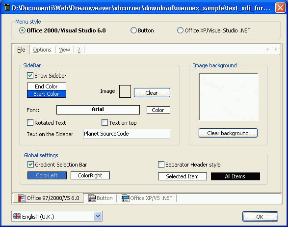



## Menu Extended

### Description

MenuExtended with MenuDesigner is a tool for advanced menu subclassing. Add/customize background, color, images, sidebar with text/image, three menu style: Office2000, Button, OfficeXP, and more... ALL WITHOUT TO WRITE CODE!!!

With MenuDesigner you customize all the properties at runtime, and has Multi-Languages support (9 languages is includes).

Visit my website http://www.vbcorner.net/eng to download the MenuExtended.dll and other info.
 
### More Info
 
If you use MenuCreator to build your menu, don't need you any help. But if you need it, call me!

             |
---                |---
**Submitted On**   |2003-03-11 20:21:20
**By**             |[gibra](https://github.com/Planet-Source-Code/PSCIndex/blob/master/ByAuthor/gibra.md)
**Level**          |Advanced
**User Rating**    |4.1 (41 globes from 10 users)
**Compatibility**  |VB 6\.0
**Category**       |[Custom Controls/ Forms/  Menus](https://github.com/Planet-Source-Code/PSCIndex/blob/master/ByCategory/custom-controls-forms-menus__1-4.md)
**World**          |[Visual Basic](https://github.com/Planet-Source-Code/PSCIndex/blob/master/ByWorld/visual-basic.md)
**Archive File**   |[Menu\_Exten162286812003\.zip](https://github.com/Planet-Source-Code/gibra-menu-extended__1-47319/archive/master.zip)

